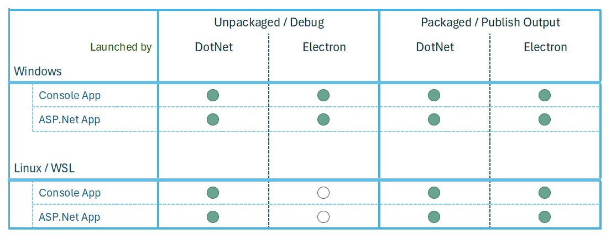

# Startup Methods

// Explain the different startup modes

- Support new commandline flags:
  - unpackedelectron
    running in debug mode, electron first, so must launch dotnet
  - unpackeddotnet
    running in debug mode, dotnet first, do not launch dotnet
  - dotnetpacked
    running from electron-builder output, dotnet first, do not launch
  - {none of the above flags}
    running from electron-builder output, electron first, launch dotnet

