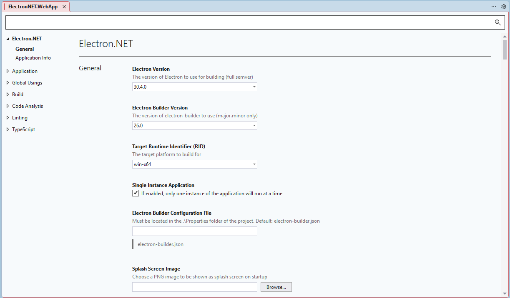
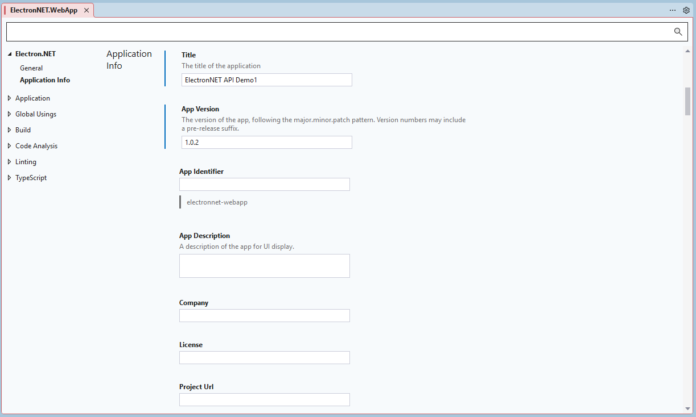

# Project Configuration


## 🔧 Visual Studio App Designer

Electron.NET provides close integration via the Visual Studio Project System and MSBuild. After adding the ElectronNET.Core package, you will see this in the project configuration page after double-click on the 'Properties' folder or right-click on the project and choosing 'Properties':







## Project File Settings

The same settings can be configured manually by editing the MSBuild properties in your `.csproj` file.  
These are the current default values when you don't make any changes:

```xml
<PropertyGroup Label="ElectronNetCommon">
    <ElectronVersion>30.4.0</ElectronVersion>
    <ElectronBuilderVersion>26.0</ElectronBuilderVersion>
    <RuntimeIdentifier>win-x64</RuntimeIdentifier>
    <ElectronSingleInstance>true</ElectronSingleInstance>
    <ElectronSplashScreen></ElectronSplashScreen>
    <ElectronIcon></ElectronIcon>
    <PackageId>$(MSBuildProjectName.Replace(".", "-").ToLower())</PackageId>
    <ElectronBuilderJson>electron-builder.json</ElectronBuilderJson>
    <Title>$(MSBuildProjectName)</Title>
</PropertyGroup>
```

### Relation to package.json

ElectronNET.Core does not work with an `electron-manifest.json` file anymore.
Since electron builder still expects a `package.json` file to exist, ElectronNET.Core is creating this under the hood automatically during build. For reference, here's the package.json template file that is being used, so you can see how the MSBuild properties are being mapped to `package.json` data:

```json
{
  "name": "$(PackageId)",
  "productName": "$(ElectronTitle)",
  "build": {
    "appId": "$(PackageId)",
    "linux": {
      "desktop": {
        "entry": { "Name": "$(Title)" }
      },
      "executableName": "$(PackageId)"
    },
    "deb": {
      "desktop": {
        "entry": { "Name": "$(Title)" }
      }
    }
  },
  "description": "$(Description)",
  "version": "$(Version)",
  "main": "main.js",
  "author": {
    "name": "$(Company)"
  },
  "license": "$(License)",
  "executable": "$(TargetName)",
  "singleInstance": "$(ElectronSingleInstance)",
  "homepage": "$(ProjectUrl)",
  "splashscreen": {
    "imageFile": "$(ElectronSplashScreen)"
  }
}
```


## 🚀 Next Steps

- **[Startup Methods](Startup-Methods.md)** - Understanding launch scenarios
- **[Debugging](../Using/Debugging.md)** - Learn about ASP.NET debugging features
- **[Package Building](Package-Building.md)** - Create distributable packages

