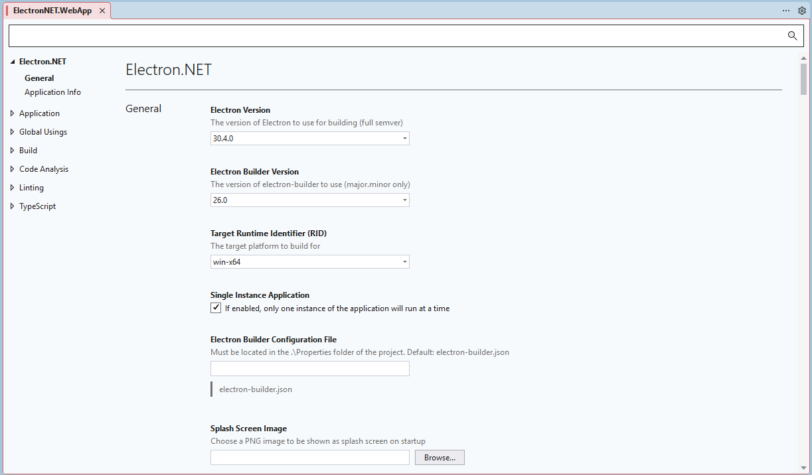
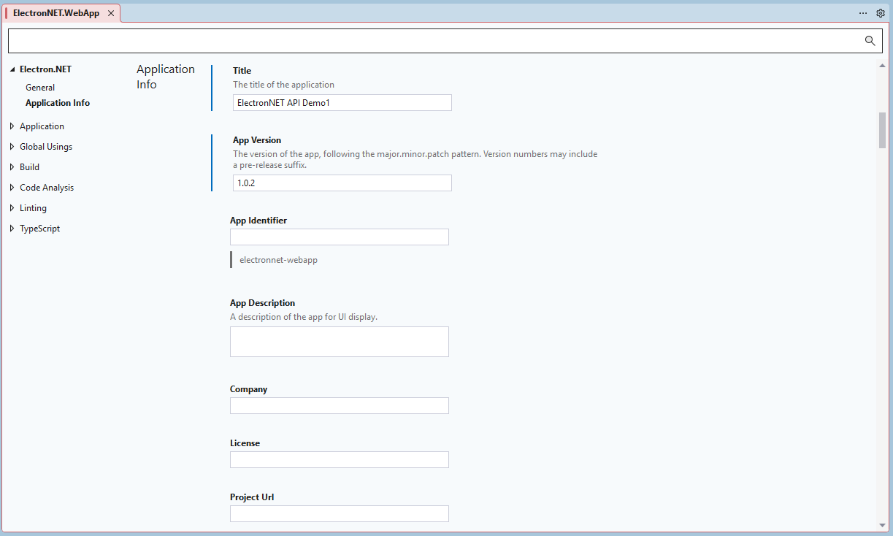

# Project Configuration


## 🔧 Visual Studio App Designer

Electron.NET provides close integration via the Visual Studio Project System and MSBuild. After adding the ElectronNET.Core package, you will see this in the project configuration page after double-click on the 'Properties' folder or right-click on the project and choosing 'Properties':







## Project File Settings

The same settings can be configured manually by editing the MSBuild properties in your `.csproj` file.  
These are the current default values when you don't make any changes:

```xml
<PropertyGroup Label="ElectronNetCommon">
    <ElectronVersion>30.4.0</ElectronVersion>
    <ElectronBuilderVersion>26.0</ElectronBuilderVersion>
    <RuntimeIdentifier>win-x64</RuntimeIdentifier>
    <ElectronSingleInstance>true</ElectronSingleInstance>
    <ElectronSplashScreen></ElectronSplashScreen>
    <ElectronIcon></ElectronIcon>
    <ElectronPackageId>$(MSBuildProjectName.Replace(".", "-").ToLower())</ElectronPackageId>
    <ElectronBuilderJson>electron-builder.json</ElectronBuilderJson>
    <Title>$(MSBuildProjectName)</Title>
    <ElectronExecutableName></ElectronExecutableName>
    <ElectronRootDir>../..</ElectronRootDir>
    <ElectronSkipExecCommands>false</ElectronSkipExecCommands>
</PropertyGroup>
```

### Product Name and Executable Name

`Title` is the product name of the application. It is used for the window title, the installer, the macOS app bundle and the Linux desktop entry, and it may contain spaces and other characters that are awkward in a file name.

`ElectronExecutableName` controls the name of the executable inside the package (electron-builder's `executableName`). When it is not set, it defaults to the following behavior:

| Target | Default |
| --- | --- |
| Windows | `$(Title)` |
| Linux / macOS | `$(ElectronPackageId)` |

So to ship a product called `My Great App` with a `mygreatapp` binary on every platform:

```xml
<PropertyGroup>
    <Title>My Great App</Title>
    <ElectronExecutableName>mygreatapp</ElectronExecutableName>
</PropertyGroup>
```

> [!NOTE]
> `ElectronExecutable` is a separate, advanced setting: it is the binary Electron.NET launches when the .NET app starts first. It defaults to `ElectronExecutableName` and only needs to be changed when the package contains a launcher stub (for example added by an electron-builder hook) that should be started instead of the Electron binary.

### Custom Packaging Layout

`ElectronRootDir` tells the .NET app where to find the Electron binary when it is started first (DotNet-First startup of a packaged app). The path is resolved relative to the directory of the .NET executable; absolute paths are used as-is.

The default `../..` matches the standard Electron-First packaging layout produced by `dotnet publish`, where the .NET app is placed in `resources/bin` of the Electron package:

```
<install-root>/
  MyApp                    # Electron executable
  resources/
    bin/
      MyApp                # .NET executable
```

If your own packaging pipeline places the .NET executable at the package root and Electron in a subdirectory, set `ElectronRootDir` accordingly:

```xml
<ElectronRootDir>electron</ElectronRootDir>
```

```
<install-root>/
  MyApp                    # .NET executable
  electron/
    MyApp                  # Electron executable
    resources/
    locales/
```

The property is also used to detect whether the app runs packaged or unpackaged, so it must point to the directory that actually contains the Electron binary.

### Build Extensibility

These properties are useful when Electron.NET is embedded into a custom build or CI pipeline:

| Property | Default | Description |
| --- | --- | --- |
| `ElectronSkipExecCommands` | `false` | Skips all `npm`/`npx` invocations of the Electron build and publish targets. Use it when the dependencies and the Electron distribution are provided by the pipeline itself (for example from a cache or an offline mirror). |
| `ElectronIntermediatePublishDir` | `$(IntermediateOutputPath)PubTmp\` | Overrides the intermediate directory the .NET app is published to before it is assembled into the Electron package. |

`ElectronPackageId` and `Title` only fall back to the project name when they are not already set, so both can be defined by a `Directory.Build.props` or passed on the command line.

### Relation to package.json

ElectronNET.Core does not work with an `electron-manifest.json` file anymore.
Since electron builder still expects a `package.json` file to exist, ElectronNET.Core is creating this under the hood automatically during build. For reference, here's the package.json template file that is being used, so you can see how the MSBuild properties are being mapped to `package.json` data:

```json
{
  "name": "$(ElectronPackageId)",
  "productName": "$(ElectronTitle)",
  "build": {
    "appId": "$(ElectronPackageId)",
    "win": {
      "executableName": "$(ElectronExecutableName)"
    },
    "mac": {
      "executableName": "$(ElectronExecutableName)"
    },
    "linux": {
      "desktop": {
        "entry": { "Name": "$(Title)" }
      },
      "executableName": "$(ElectronExecutableName)"
    },
    "deb": {
      "desktop": {
        "entry": { "Name": "$(Title)" }
      }
    }
  },
  "description": "$(Description)",
  "version": "$(Version)",
  "main": "main.js",
  "author": {
    "name": "$(Company)"
  },
  "license": "$(License)",
  "executable": "$(TargetName)",
  "singleInstance": "$(ElectronSingleInstance)",
  "homepage": "$(ProjectUrl)",
  "splashscreen": {
    "imageFile": "$(ElectronSplashScreen)"
  }
}
```

### App Icon Path

The `ElectronIcon` property supports classic icon files (such as `.ico` and `.icns`) and modern macOS `.icon` app icon packages.

For `.icon`, provide the folder path (for example `Assets/MyApp.icon`). During build/publish, Electron.NET copies the full directory into the Electron output so `electron-builder.json` can reference it (for example `"mac": { "icon": "MyApp.icon" }`).

### Node.js Integration

Electron.NET requires Node.js integration to be enabled for IPC to function. If you are not using the IPC functionality you can disable Node.js integration like so:

```csharp
WebPreferences wp = new WebPreferences();
wp.NodeIntegration = false;
BrowserWindowOptions browserWindowOptions = new BrowserWindowOptions
{
    WebPreferences = wp
};

```


### Preload Script

If you require the use of a [preload script](https://www.electronjs.org/docs/latest/tutorial/tutorial-preload), you can specify the file path of the script when creating a new window like so:

```csharp
WebPreferences wp = new WebPreferences();
wp.Preload = "path/to/preload.js";
BrowserWindowOptions browserWindowOptions = new BrowserWindowOptions
{
    WebPreferences = wp
};
```

> [!IMPORTANT]
> When using a preload script _AND_ running a Blazor app, `IsRunningBlazor` must be set to `false` (or removed) and the following lines must be added to the preload script:
> ```js
> global.process = undefined;
> global.module = undefined;
> ```


## 🚀 Next Steps

- **[Startup Methods](Startup-Methods.md)** - Understanding launch scenarios
- **[Debugging](../Using/Debugging.md)** - Learn about ASP.NET debugging features
- **[Package Building](Package-Building.md)** - Create distributable packages

